# DOCKER

## What is Docker?

 > Docker is a way to package softwares so they can run on any machines (Windows, mac, unix)
 > Docker revolutionized the way we build software by making microservicebased application development possible

## Why Docker?

 > In old times we used to had hardware and installed os ( kernel and ui ) on top of that, to run an application, we had to compile the code and sort of all application dependecies. If we needed another application or more capacity to accomodate application workload hikes, we had to purchase new hardware, do installation and configuration.
 > Later virtualization came into picture it added one additional layer between the hardware and the os called hypervisor. It allowed users to run multiple isolated applications to run virtual machines with their OS.
 > We still had to install software and set up dependencies on every VM. I mean application were not portable. They worked on few machines rather than on others.

## How does Docker work?

 > The docker engine runs on top of the host operating system. Docker engine includes a server process (dockerd) that manages docker containers on the host system. Docker containers are designed to isolate applications and their dependencies, ensuring that they can run consistently across different environments.

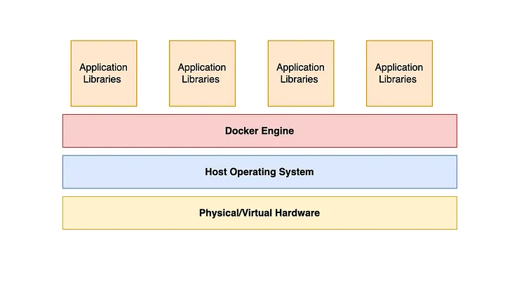

## What is a Docker file(dockerfile)?

 > Dockerfile is a blueprint to build a docker image.

## What is a Docker Image?

 > Docker image is a template for running docker containers.
 > It contain all the dependencies needed to execute code inside a container.

## What is a Docker container?

 > Container is just a running process.
 > One docker image can be used to spun up multiple processes/container many times, at many places. They can be easily shared with anyone, and they can use it to run the process.

# Getting Started With Docker

## Prerequisite

 > Docker must be installed in your local machine/cloud VM.

### Linux:

 > If you are running linux on a local laptop, virtual box, or cloud VM then you can use package managers to install Docker. [Follow the instruction in this blog post](https://docs.docker.com/engine/install/)

### For Mac and Windows:

 > You can install Docker Desktop which will allow you to run Docker on your local machine.

 Getting started with Docker is a piece of cake. Just run the below command
```
 docker run -d -t --name DockerThor alpine
 docker run -d -t busybox
```

 > These will spin up 2 containers from the docker images alpine and busybox. Both are minimalist, public Linux docker images stored on Docker Hub.

  >> -d wil run the container in detach mode ( in the background )
  >> -t will attach a tty terminal to it
  >> --name will give a name to the container. If you do not provide it, the container will get a random name

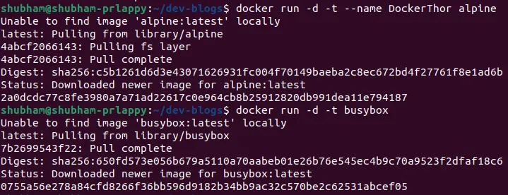

> Note: Since this is the first time we ran a docker run with above mention images, docker has to download(pull) the images on the local machine (from the dockerhub)

## List the containers running/stopped in your local machine

```
 > docker ps # for running containers
 > docker ps -a # for listing all containers
```

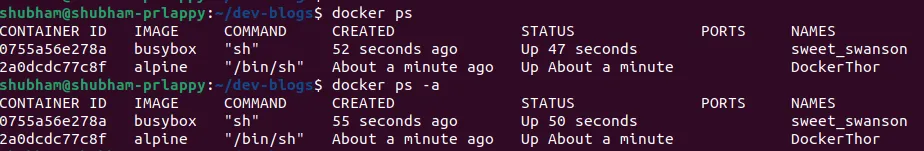

## Listing docker images on the local machine

```
 > docker image ls
```

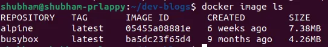

> You can see the size of the images used for running Linux-based docker containers. It's very small compared to normal Linux-based machines such as Ubuntu, amazon-linux, centos, etc.

## We can interact with running containers either by passing a command or opening an interactive session with it

```
 > docker exec -it <container id> <shell>
```

 >> docker exec will allow you to get inside the running docker container
 >> --it will open an interactive session with docker
 >> shall can be sh, bash, zsh, etc.

## Let's run some commands to get the container info

```
 > docker exec -t DockerThor ls ; ps
 > docker exec -t 0755a56e278a free -m
```

 >> -t to open tty session
 >> DockerThor is the container name
 >> ls ; ps will run 2 commands, ls and ps

 >> 0755a56e278a is the container id and free -m is the command to check the memory usage

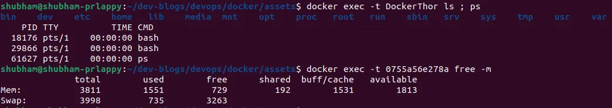

Now we will open an interactive shell session with a container using the -lt option

```
 > docker exec -it 2a0dcdc77c8f sh 
 # you can type "exit" to come out of the session
```

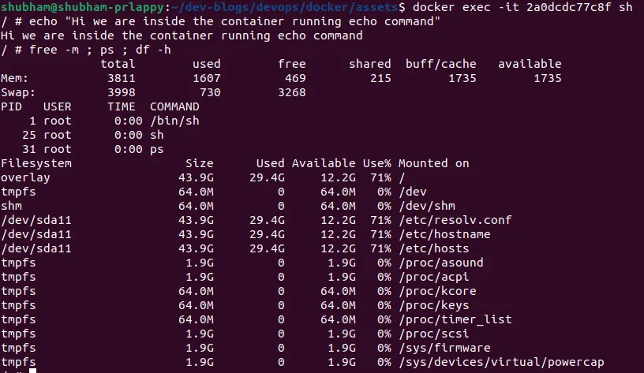

## Starting stopping and deleting a container

```
 # to stop a running container
 > docker stop <Container name or ID>

 # to start a stopped container
 > docker start <Container name or ID>
```

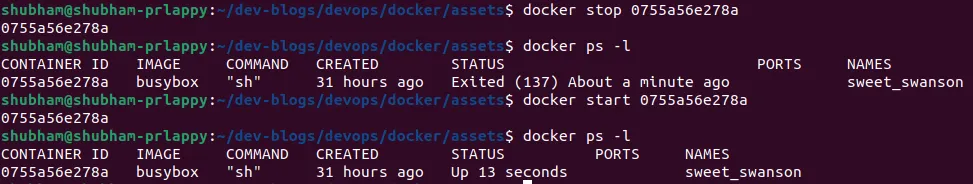

```
 # To kill a running container, you either stop it before using rm command to remove it
 # docker stop <container name or ID>
 # docker rm <container name or ID>
 docker stop 0755a56e278a
 docker rm 0755a56e278a

 # or use -f flag to force delete the container
 docker rm -f DockerThor
```

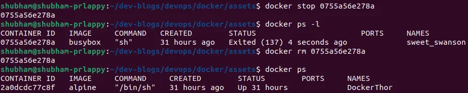

# Building Docker image

## Docker Networking

 > Docker provides multiple kind of network

 > 1. Default bridge
    >> Suppose you are running one nginx container with an nginx image from Dockerhub, and you want to access the web server
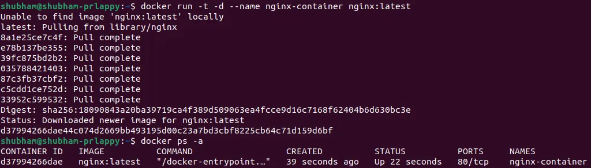
    >> From the screenshot, you can see that the Nginx web server is running on port 80. If we log into the Nginx container and run 'curl 127.0.0.1:80', it will return the HTML response from the web server
        >>> 127.0.0.1 is a loopback address, it always refers to the current device (localhost)

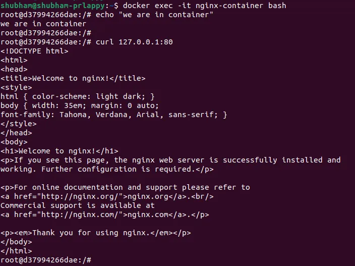

    >> As you can see above, the web server inside the container did what we expected it to do
    >> Lets try to reach the web server from the host machine (your laptop/VM)

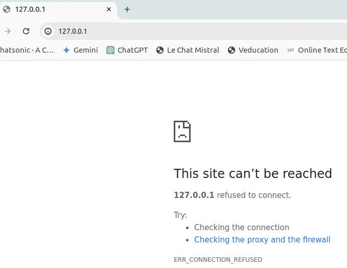

    >> Do we could not connect to the nginx web server running on the container

### Deep dive into networks

    >> If you inspect the docker container by running the docker inspect command and scrolling to the bottom. You will see docker using bridge network, and more details about the network.
    ```
    >> docker inspect nginx-container
    ```
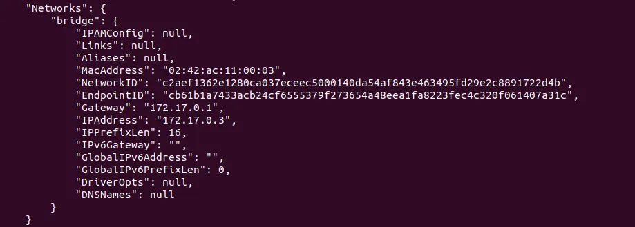

    ```
    >> docker network ls
    ```
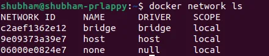

    >> if you inspect the network, you will find the containers using this default bridge network

    ```
    >> docker network inspect bridge
    ```
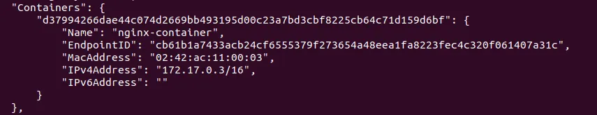

    >> By default docker will use default bridge network, and annoying thing about default bridge network is that you cannot access the services offered by docker containers be default. You have to manually expose the services by forwarding the ports.

### Port forwarding

    ```
    > docker run -d -p <host port>:<container port> --name <container name> Image

    # Port forwarding -> forward port 80 of container to port 5000 on the host machine
    > docker run -d -p 5000:80 --name nginx-container nginx:latest
    ```

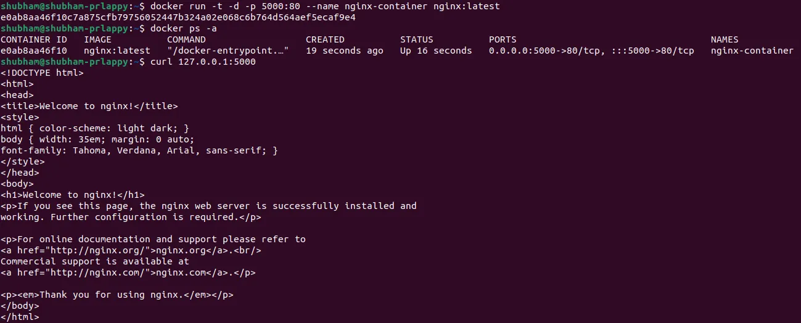

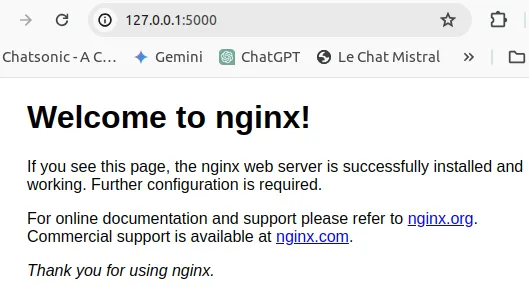

    >> Docker does not want us to use the default network, instead, they want us to create our own network.
    >> Lets create two containers using busybox image. Once we have the containers running, we will try to ping each other from inside the container.
    >> Create two containers and use `docker inspect` to get the IP address of each other
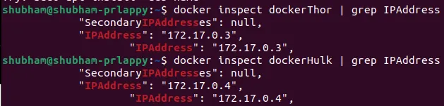
    >> As you can see the IP address of both the containers are in the same network (default bridge network)
    >> Lets ping one another with name and IP address
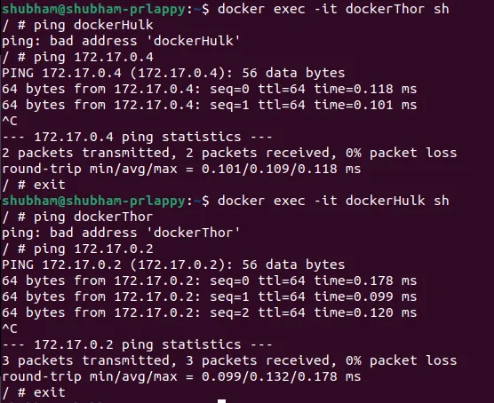
	 >> If you look at the above screenshot, you can see that both containers can talk to each other but not by name.
	 >> **Default bridge network does not provide internal dns name resolution. Also they will use the host network so they will not be isolated**
	 
> 2. User-defined bridge network

	> Create network
	
	```
		> docker network create docker-pvt-network
	```
	> Create an nginx container with the name nginx-con using this new network
```
	> docker run -itd --network docker-pvt-network --name nginx-con nginx
	> docker ps	
```
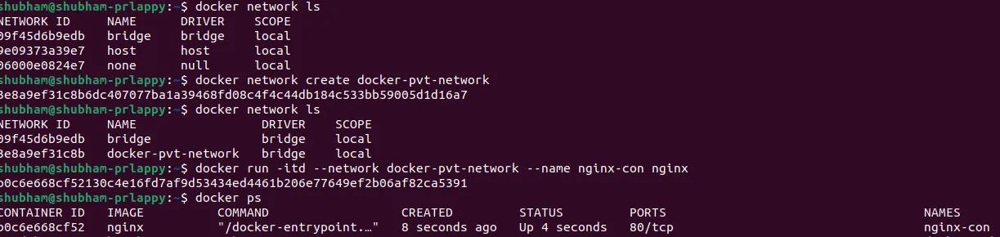
	 > Let's inspect the docker container and network
	 ```
		> docker network inspect docker-pvt-network
	```
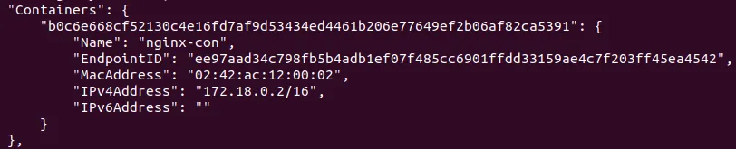
```
	   >docker inspect nginx-con
```
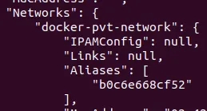
	> Now if we try to access the nginx web server running in the container nginx-con from our host machine on port 80, it will not work. We still have to do the port forwarding to the host port to access the web server running on the container
	> But it got one thing sorted - name resolution. Now if we ping containers in a user-defined bridge network, it should work.
	> Lets create one busybox container and try to ping the nginx-con container
	
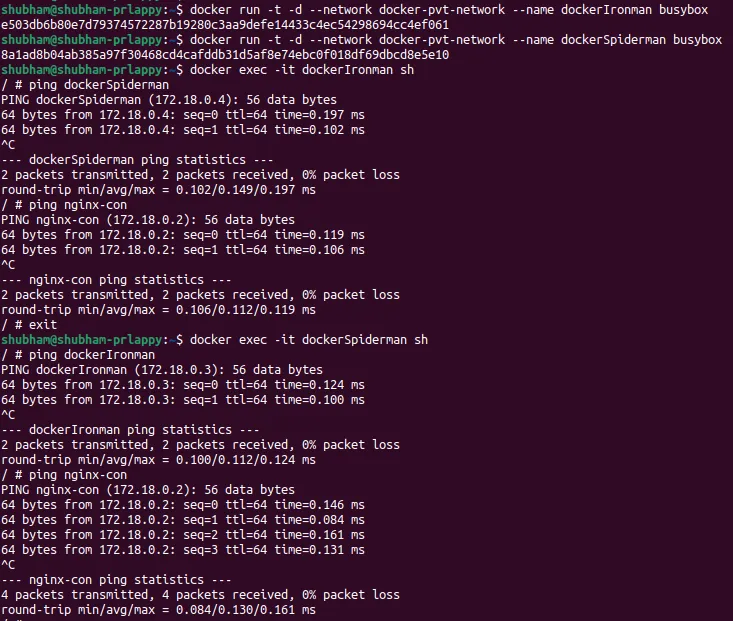	  
	>> User defined network will create a new network which will be different from the host network. It will provide isolation to containers running in this network. It will also provide name resolution for all containers within network.

>3. Host network
```
	> docker run -td --network host --name nginx-server nginx:latest docker ps
```
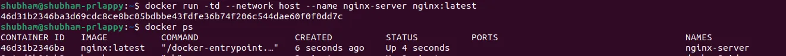
	> This will run the nginx container in the host network itself.
	> If we try to reach the nginx server from local host, it should work.
	> If we try to see the IP address of the container
```
	> docker inspect nginx-server | grep IPAddress
```
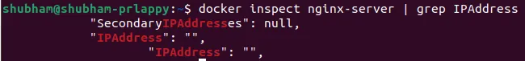
	 > What? It does not have its IP address, it used the IP address of our host machine.
	 > There are other types of networks but this blog is getting way too long.
	 
## Docker Volumes
> Docker isolates all content, code, and data in a container from your local filesystem. This means, that when you delete a container within Docker Desktop, all the content within it is deleted.
> Sometimes you may want to persist data that a container generates. This is when you can use volumes.

**Bind Mount**
> When you use a bind mount, a file or directory on the host machine is mounted into a container.

**Docker Volumes**
>A volume is a location in your local filesystem, managed by Docker.
>Volume doesnt increase the size of the containers using it, and the volume's content exist outside the lifecycle of a given container.

**How to use volumes in docker**
> There are 2 ways of using volumes with docker, `--mount` and `-v` (or `--volume`). `-v` syntax combines all the options in one field, while the `--mount` syntax separates them
> 
> `**-v**` or `**--volume**`: Consists of three fields, separated by colon characters(`**:**`).
> 	* The first field is the path to the file or directory on the host machine in case of bind mounts, or the name of the volume.
> 	* The second field is the path where the file or directory is mounted in the container.
> 	* The third field is optional. It is a comma-separated list of options, such as `ro`,`w` and `rw`
> `**--mount**`: Consists of multiple key-value pairs, separated by commas
> 	* The `type` of the mount, which can be `bind`, `volume`, or `tmpfs`
> 	* The `source` of the mount
> 	* The `destination` takes as its value the path where the file or directory is mounted in the container

**Example: Docker container with a bind mount**
We spun up 4 containers and mounted the same directory/folder from host machine to all containers.
```
> mkdir docker-bind-mount
> docker run -t -d -v docker-bind-mount:/app/log --name captain-america busybox
> docker run -t -d -v docker-bind-mount:/app/log --name thor busybox
> docker run -t -d -v docker-bind-mount:/app/log --name hulk busybox
> docker run -t -d -v docker-bind-mount:/app/log --name iron-man alpine

# Command with --mount option
> docker run -t -d --mount type=bind,source=docker-bind-mount,target=/app/log --name captain-america busybox
```
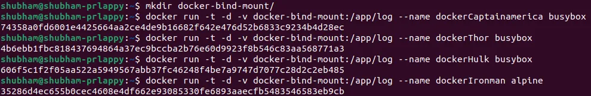
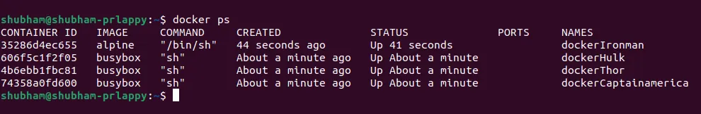
>Let's write some logs inside each container at the path where we have mounted the bind-mounts - /app/log

>If you look closely, you will see the files we created in 1st and 2nd containers, are visible in the third container, and the files created in the first 3 containers are visible in the 4th (docker-captain-america) container.

>Also, the common-docker-data file contains the content from other containers.

> This example demonstrated how we can share the files/logs across multiple containers with ease.

> But, here is one catch. If we go to the local host and list the di

