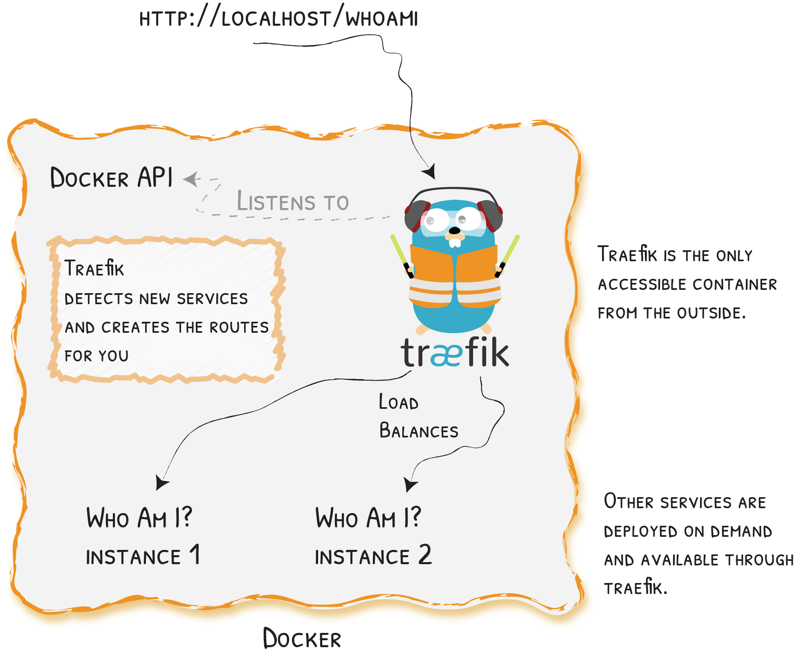

## Use case of traefik
> traefik runs as a docker container which is the only container which is accessible from outside, it load balances between the instances
> Other services are deployed on demand and available through traefik
> traefik detects new services and creates the routes for you
> As a pre-requisite you need to have docker and docker-compose installed on your system

## Launch Traefik With the Docker Provider
> Create a `docker-compose.yml` file where you will define a `reverse-proxy` service that uses the official Traefik image:
```
## docker-compose.yml
version: '3'

services:
	reverse-proxy:
		# The official v3 Traefik docker image 
		image: traefik:v3.0
		# Enables the web UI and tells Traefik to listen to docker
		command: --api.insecure=true --providers.docker
		ports:
			# The HTTP port 
			- "80:80" 
			# The Web UI (enabled by --api.insecure=true)
			- "8080:8080" 
		volumes: 
			# So that Traefik can listen to the Docker events 
			- /var/run/docker.sock:/var/run/docker.sock

```
> Save the file and start the reverse proxy with the following command:
```
docker-compose up -d reverse-proxy
```
> We can open a browser and go to `http://localhost:8080/api/rawdata` to see Traefik's API rawdata

## Traefik Detects New Services and Creates the Route for You

> 